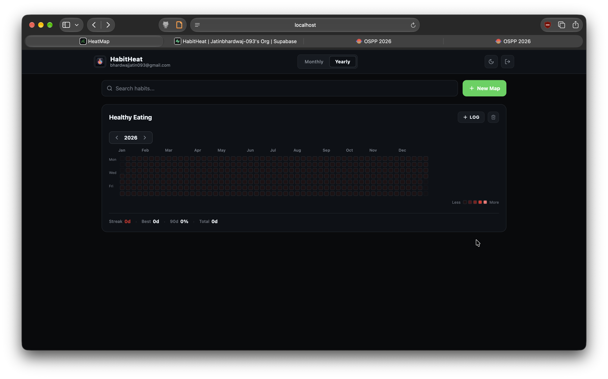
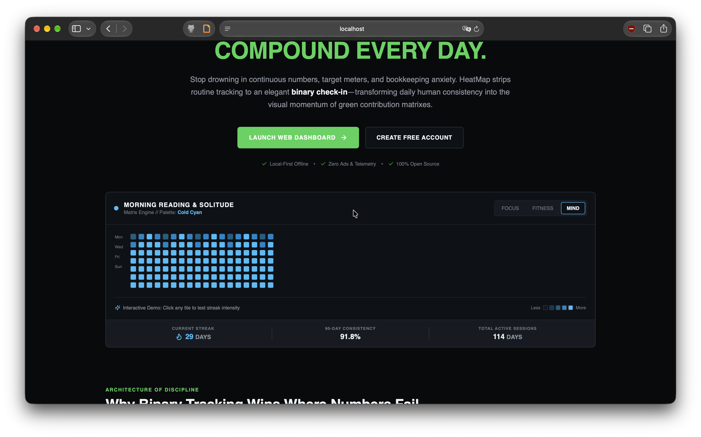

<p align="center">
  
</p>

<h1 align="center">HabitHeat</h1>

<p align="center">
  <strong>A high-density binary habit matrix engine inspired by GitHub contribution graphs.</strong>
</p>

<p align="center">
  <a href="LICENSE"></a>
  
  
  
  
</p>

<p align="center">
  <a href="#core-philosophy">Philosophy</a> •
  <a href="#features">Features</a> •
  <a href="#screenshots">Screenshots</a> •
  <a href="#quickstart">Quickstart</a> •
  <a href="#architecture">Architecture</a> •
  <a href="#license">License</a>
</p>

---

<p align="center">
  
</p>

## Core Philosophy

Most habit trackers fail because they demand excessive bookkeeping: *“8,450 / 10,000 steps”*, *“42 / 60 minutes”*, or complex slider ratings. This creates cognitive friction and guilt.

**HabitHeat strips tracking down to a pure boolean:**
> **Did you show up today? Yes or No.**

Inspired by software engineering commit history, HabitHeat translates daily human consistency into the visual momentum of green contribution matrices. Each consecutive day adds momentum, graduating tile colors from dim jade to vivid emerald.

---

## Features

- **Full-Year Annual Grid (52 Weeks)**: View an entire year of discipline (364 days) in a single glance with intuitive month headers and centered matrix alignment.
- **Dynamic Streak Intensity**: Cell brightness and color depth scale organically with consecutive streak length (1 day, 3 days, 7 days, and 14+ days).
- **Monthly Detail Calendar**: Instantly toggle between annual macro view and monthly micro view for focused date logging and notes.
- **Isolated Habit Matrices**: Every habit commands its own dedicated grid, autonomous streak calculation, and independent palette. Never jumble fitness with deep work.
- **Curated Color Palettes**:
  - `Emerald Matrix` (Classic GitHub green)
  - `Industrial Amber` (Warm discipline)
  - `Cold Cyan` (Terminal blue)
  - `Obsidian` (Minimalist mono)
  - `Crimson` (High intensity)
- **Soft Minimalist Aesthetic**: Clean typography powered by `SF Pro Rounded`, balanced spacing, and zero distracting animations or emojis.
- **Adaptive Light & Dark Modes**: Automatic system preference detection paired with a manual toggle for instant theme switching.
- **Local-First & Cloud-Synced**: Data persists offline in `AsyncStorage` scoped per user account, with seamless cloud authentication via Supabase.
- **Cross-Platform**: Run in any web browser, compile to standalone desktop apps via Electron, or deploy to mobile devices with glanceable widgets.

---

## Screenshots

<div align="center">
  
  <p><em>HabitHeat interactive landing page with live 52-week annual matrix simulator</em></p>
</div>

<br />

<div align="center">
  
  <p><em>Individual tracker dashboard featuring centered matrix grids and inline streak metrics</em></p>
</div>

---

## Quickstart

### Prerequisites

- [Node.js](https://nodejs.org/) (v18 or higher recommended)
- `npm` or `yarn`

### 1. Clone & Install Dependencies

```bash
git clone https://github.com/Jatinbhardwaj-093/HeatMap.git habitheat
cd habitheat
npm install
```

### 2. Run Development Server

```bash
# Run Web Application
npm run web

# Run macOS Desktop App (Requires Electron)
npm run dev:desktop

# Run with Expo Go for iOS & Android
npm start
```

### 3. Production Builds

```bash
# Export static production web build (outputs to ./dist)
npx expo export -p web

# Build standalone macOS Universal .DMG installer (outputs to ./release)
npm run build:mac
```

---

## Architecture

HabitHeat is built using a modern universal React Native architecture:

```
habitheat/
├── assets/                  # App icons, favicons, and repository assets
│   ├── favicon.png          # Green 3x3 matrix contribution grid icon
│   └── screenshots/         # Dashboard & landing showcase screenshots
├── electron/
│   └── main.js              # Electron desktop main process & window wrapper
├── src/
│   ├── components/          # Reusable UI components
│   │   ├── Header.tsx       # Navbar with brand icon, view switcher & theme toggle
│   │   ├── HeatmapCard.tsx  # Streamlined habit tracker card with inline metrics
│   │   ├── YearlyView.tsx   # Centered 52-week contribution matrix grid
│   │   ├── MonthlyView.tsx  # Month calendar view with date selection
│   │   ├── DayCell.tsx      # Individual matrix tile with intensity levels
│   │   ├── LandingPage.tsx  # Interactive landing page with live matrix simulator
│   │   └── LoginScreen.tsx  # Rounded authentication interface
│   ├── constants/
│   │   └── palettes.ts      # 5-tier intensity color palettes
│   ├── theme/
│   │   └── theme.ts         # ThemeProvider context & light/dark tokens
│   ├── types/
│   │   └── heatmap.ts       # TypeScript models for HeatMaps, Days & Views
│   └── utils/
│       ├── dateUtils.ts     # Grid date math & month header calculations
│       ├── streakUtils.ts   # Consecutive streak & intensity level algorithms
│       ├── storage.ts       # Local-first storage scoped per user account
│       └── supabase.ts      # Supabase cloud client initialization
├── App.tsx                  # Root navigation router & state container
├── app.json                 # Expo project configuration
└── package.json             # Build scripts & dependency manifest
```

---

## Tech Stack

- **Framework**: [Expo SDK 52](https://expo.dev/) + [React Native Web](https://necolas.github.io/react-native-web/) (0.76)
- **Language**: [TypeScript 5.3](https://www.typescriptlang.org/)
- **Icons**: [Lucide Icons](https://lucide.dev/) (`lucide-react-native`)
- **Desktop Runtime**: [Electron 34](https://www.electronjs.org/) + `electron-builder`
- **Auth & Cloud Sync**: [@supabase/supabase-js](https://supabase.com/)
- **Local Persistence**: [@react-native-async-storage/async-storage](https://react-native-async-storage.github.io/async-storage/)

---

## Contributing

Contributions, issues, and feature requests are welcome! Feel free to check the [issues page](https://github.com/Jatinbhardwaj-093/HeatMap/issues) or submit a Pull Request.

1. Fork the Project
2. Create your Feature Branch (`git checkout -b feature/AmazingFeature`)
3. Commit your Changes (`git commit -m 'feat: add amazing feature'`)
4. Push to the Branch (`git push origin feature/AmazingFeature`)
5. Open a Pull Request

---

## License

Distributed under the **MIT License**. See [LICENSE](LICENSE) for more information.

Copyright (c) 2026 **Jatin Bhardwaj**
