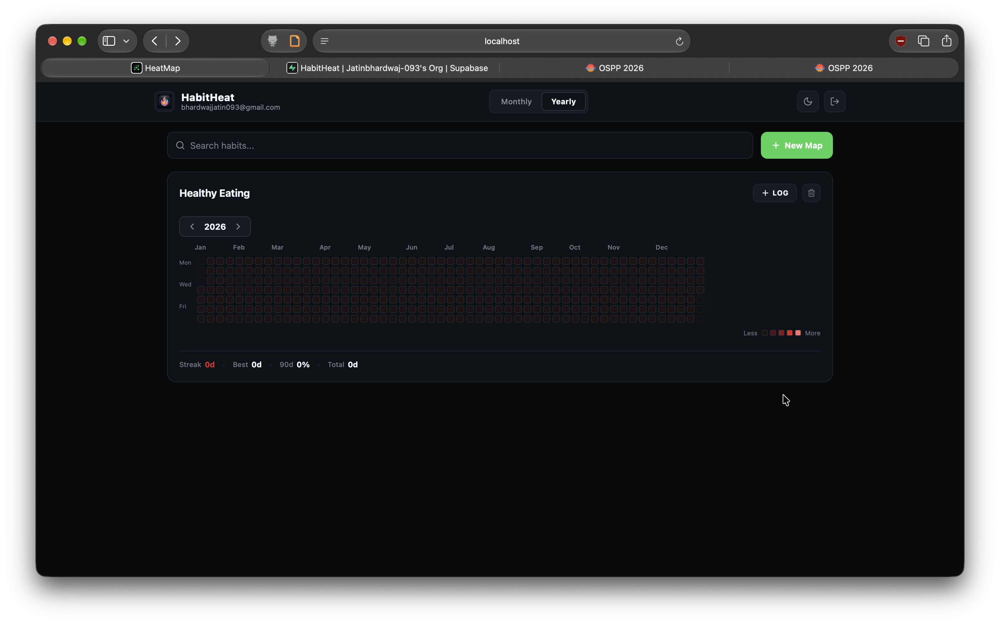
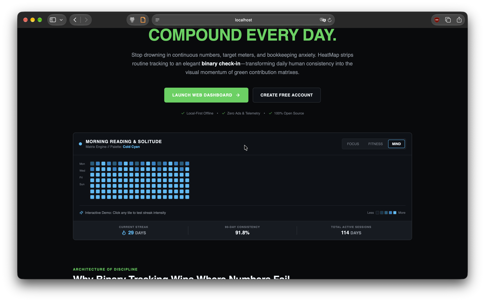

<p align="center">
  
</p>

<h1 align="center">TrackHeat</h1>

<p align="center">
  <strong>A high-density binary habit matrix engine inspired by GitHub contribution graphs.</strong>
</p>

<p align="center">
  <a href="LICENSE"></a>
  
  
  
  
  
</p>

<p align="center">
  <a href="#core-philosophy">Philosophy</a> •
  <a href="#features">Features</a> •
  <a href="#screenshots">Screenshots</a> •
  <a href="#quickstart">Quickstart</a> •
  <a href="#architecture">Architecture</a> •
  <a href="#tech-stack">Tech Stack</a> •
  <a href="#license">License</a>
</p>

---

<p align="center">
  
</p>

## Core Philosophy

Most habit trackers fail because they demand excessive bookkeeping: *"8,450 / 10,000 steps"*, *"42 / 60 minutes"*, or complex slider ratings. This creates cognitive friction and guilt.

**TrackHeat strips tracking down to a pure boolean:**
> **Did you show up today? Yes or No.**

Inspired by software engineering commit history, TrackHeat translates daily human consistency into the visual momentum of green contribution matrices. Each consecutive day adds momentum, graduating tile colors from dim jade to vivid emerald.

---

## Features

- **Full-Year Annual Grid (52 Weeks)**: View an entire year of discipline (364 days) in a single glance with intuitive month headers and centered matrix alignment.
- **Zero-Scroll Mobile Micro-Matrix**: Mobile viewports automatically calculate micro cell dimensions (~4.5px cells with 1.5px gaps) with non-overlapping bi-monthly markers (Jan, Mar, May, Jul, Sep, Nov) and compact weekday labels (M, W, F, S). Zero horizontal scrolling required on mobile phones.
- **Dynamic Streak Intensity**: Cell brightness and color depth scale organically with consecutive streak length (1 day, 3 days, 7 days, and 14+ days).
- **Widget Studio**: Preview and design compact Small (2x2) and Medium (4x2) home screen widgets with real-time streak badges, current weekly commit heat, and custom palette previews.
- **Monthly Detail Calendar**: Instantly toggle between annual macro view and monthly micro view for focused date logging and notes.
- **Isolated Habit Matrices**: Every habit commands its own dedicated grid, autonomous streak calculation, and independent palette. Never jumble fitness with deep work.
- **Dual-Tier Offline Persistence & Cloud Sync**: Data persists locally in `AsyncStorage` scoped per user account, paired with automatic cloud backup and cross-device sync via Supabase Auth metadata (`user_metadata.habits`).
- **Keyboard-Aware Mobile Authentication**: Clean modal authentication with dynamic virtual keyboard height tracking, automatic input field auto-scrolling on focus, and safe-area offsets on Android and iOS.
- **Curated Color Palettes**:
  - `Emerald Matrix` (Classic GitHub green)
  - `Industrial Amber` (Warm discipline)
  - `Cold Cyan` (Terminal blue)
  - `Obsidian` (Minimalist mono)
  - `Crimson` (High intensity)
- **Soft Minimalist Aesthetic**: Clean typography powered by `SF Pro Rounded`, balanced spacing, and zero distracting animations or emojis.
- **Modern Cross-Platform Styling**: Clean platform-specific elevation handling using `boxShadow` on Web and native elevation shadows on iOS and Android.
- **Adaptive Light & Dark Modes**: Automatic system preference detection paired with a manual toggle for instant theme switching.
- **Cross-Platform**: Run in any web browser, compile to standalone desktop apps via Electron, or run natively on iOS and Android with Expo Go and standalone builds.

---

## Screenshots

<div align="center">
  
  <p><em>TrackHeat interactive landing page with live 52-week annual matrix simulator</em></p>
</div>

<br />

<div align="center">
  
  <p><em>Individual tracker dashboard featuring centered matrix grids and inline streak metrics</em></p>
</div>

---

## Quickstart

### Prerequisites

- [Node.js](https://nodejs.org/) (v18 or higher recommended)
- `npm` or `yarn`

### 1. Clone & Install Dependencies

```bash
git clone https://github.com/Jatinbhardwaj-093/HeatMap.git trackheat
cd trackheat
npm install
```

### 2. Run Development Server

```bash
# Run Web Application
npm run web

# Run macOS Desktop App (Requires Electron)
npm run dev:desktop

# Run with Expo Go for iOS & Android
npm start
```

### 3. Production Builds

```bash
# Export static production web build (outputs to ./dist)
npx expo export -p web

# Build standalone macOS Universal .DMG installer (outputs to ./release)
npm run build:mac
```

---

## Architecture

TrackHeat is built using a modern universal React Native architecture:

```
trackheat/
├── assets/                  # App icons, favicons, and repository assets
│   ├── favicon.png          # Green 3x3 matrix contribution grid icon
│   └── screenshots/         # Dashboard & landing showcase screenshots
├── electron/
│   └── main.js              # Electron desktop main process & window wrapper
├── src/
│   ├── components/          # Reusable UI components
│   │   ├── CreateHeatmapModal.tsx # New habit creation dialog with palette picker
│   │   ├── DayCell.tsx      # Individual matrix tile with intensity levels
│   │   ├── DayDetailModal.tsx # Day inspection modal with completion toggle & notes
│   │   ├── Header.tsx       # Navbar with brand icon, view switcher & theme toggle
│   │   ├── HeatmapCard.tsx  # Habit tracker card with inline metrics & action menu
│   │   ├── LandingPage.tsx  # Responsive landing page with live simulator & mobile micro-grid
│   │   ├── LoginScreen.tsx  # Keyboard-aware authentication interface with Supabase
│   │   ├── MonthlyView.tsx  # Month calendar view with date selection
│   │   ├── StatsOverview.tsx# Top-level metric aggregates & completion streaks
│   │   ├── ViewSwitcher.tsx # Segmented toggle between Monthly and Yearly views
│   │   ├── WidgetStudioModal.tsx # Home screen widget configuration & preview studio
│   │   └── YearlyView.tsx   # Centered 52-week contribution matrix grid
│   ├── constants/
│   │   └── palettes.ts      # 5-tier intensity color palettes
│   ├── theme/
│   │   └── theme.ts         # ThemeProvider context & light/dark tokens
│   ├── types/
│   │   └── heatmap.ts       # TypeScript models for HeatMaps, Days & Views
│   └── utils/
│       ├── dateUtils.ts     # Grid date math & month header calculations
│       ├── streakUtils.ts   # Consecutive streak & intensity level algorithms
│       ├── storage.ts       # Dual-tier offline storage & Supabase cloud sync
│       └── supabase.ts      # Supabase cloud client initialization
├── App.tsx                  # Root navigation router, safe area provider & state container
├── app.json                 # Expo SDK 57 project configuration
└── package.json             # Build scripts & dependency manifest
```

---

## Tech Stack

- **Framework**: [Expo SDK 57](https://expo.dev/) (`~57.0.26`)
- **Language**: [TypeScript 6.0](https://www.typescriptlang.org/) (`~6.0.3`)
- **Core Runtime**: [React 19](https://react.dev/) (`19.2.3`) & [React Native 0.86](https://reactnative.dev/) (`0.86.3`)
- **Web Engine**: [React Native Web](https://necolas.github.io/react-native-web/) (`~0.21.0`)
- **Safe Area**: [React Native Safe Area Context](https://github.com/th3rdwave/react-native-safe-area-context) (`~5.7.0`)
- **Icons**: [Lucide Icons](https://lucide.dev/) (`lucide-react-native`)
- **Desktop Runtime**: [Electron 34](https://www.electronjs.org/) + `electron-builder`
- **Auth & Cloud Sync**: [@supabase/supabase-js](https://supabase.com/) (`^2.116.0`)
- **Local Persistence**: [@react-native-async-storage/async-storage](https://react-native-async-storage.github.io/async-storage/) (`2.2.0`)

---

## Contributing

Contributions, issues, and feature requests are welcome! Feel free to check the [issues page](https://github.com/Jatinbhardwaj-093/HeatMap/issues) or submit a Pull Request.

1. Fork the Project
2. Create your Feature Branch (`git checkout -b feature/AmazingFeature`)
3. Commit your Changes (`git commit -m 'feat: add amazing feature'`)
4. Push to the Branch (`git push origin feature/AmazingFeature`)
5. Open a Pull Request

---

## License

Distributed under the **MIT License**. See [LICENSE](LICENSE) for more information.

Copyright (c) 2026 **Jatin Bhardwaj**
